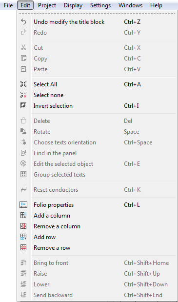

.. _en/folio/properties/display

========================
Display folio properties
========================

At QElectroTech the properties from the folio can be common at all folios from the same 
project. QElectroTech also allows that each folio has its own properties. For example, 
two folios can be created by different authors or they can have different revision.  

.. note::

   To reduce the creation time, QElectroTech allows creating some pre-setting for all the future 
   folios that will be created on the project. For more information about how to pre-define folio 
   properties, please refert to `Project properties <../../../en/project/properties/index.html>`_ section.

The folio properties window can be displayed from the Menu bar, from the project panel, from the 
workspace, from the tool bar, from the folio tabs bar and with the corresponding keyboard shortcut. 

.. figure:: graphics/qet_folio_properties.png
   :align: center

   Figure: Folio properties PopUP window

Display folio properties from Menu bar
~~~~~~~~~~~~~~~~~~~~~~~~~~~~~~~~~~~~~~

    1. Select **Edit > Folio properties** menu item to display the folio properties from the active folio.

   Figure: QElectroTech Edit menu

Display folio properties from workspace
~~~~~~~~~~~~~~~~~~~~~~~~~~~~~~~~~~~~~~~

    1. Right click on the workspace area. Should be somewhere without any element, connector, table, etc.
    2. Click the option **Folio properties** to display the folio properties from the active folio.

.. figure:: graphics/qet_workspace_prop.png
   :align: center

   Figure: QElectroTech Workspace Menu

Display folio properties from toolbar
~~~~~~~~~~~~~~~~~~~~~~~~~~~~~~~~~~~~~

    1. Select the icon |icon_folio_prop| from the toolbar to display the folio properties from the active folio. 

.. |icon_folio_prop| image:: graphics/qet_folio_prop_icon.png

.. note::

   If the toolbar is not displayed, it can be displayed from **Settings > Display > Diagram**. 

Display folio properties from project panel
~~~~~~~~~~~~~~~~~~~~~~~~~~~~~~~~~~~~~~~~~~~

    1. Right click on the folio where any property should be defined, it can be an unactivated page from a inactive project.
    2. Click the option **Folio properties** to display the folio properties from the active folio.

.. figure:: graphics/qet_project_panel.png
   :align: center

   Figure: QElectroTech Project panel 

.. note::

   If the project panel is not displayed, it can be displayed from **Settings > Display > Projects**

Display folio properties from folio tabs bar
~~~~~~~~~~~~~~~~~~~~~~~~~~~~~~~~~~~~~~~~~~~~

    1. Doble click on the folio tab to display the folio properties.

.. figure:: graphics/qet_folio_tab.png
   :align: center

   Figure: QElectroTech folio tabs bar

Display folio properties using keyboard shortcut
~~~~~~~~~~~~~~~~~~~~~~~~~~~~~~~~~~~~~~~~~~~~~~~~

QElectroTech allows using keyboard shortcut to increase the working efficiency.

    1. Press ``Ctrl + l`` to display the folio properties from the active folio.

.. seealso::

    For more information about QElectroTech keyboard shortcut, please refers to `Menu bar <../../../en/interface/menubar.html>`_ section.