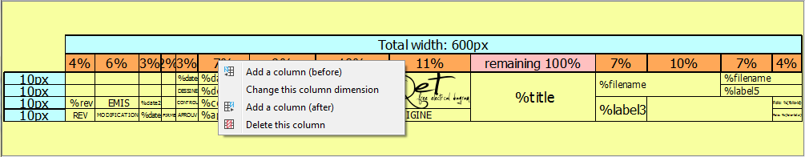

.. _en/folio/title_block/title_block_editor/edition/row_delete

===========================
Delete row from title block
===========================

QElectroTech `Title Block editor`_ allows only deleting `rows`_ of the `Title Block`_ from the 
`Drawing area`_.

    1. Right click on the head from the `row`_ which should be deleted.
    2. Click the option **Delete this row** to delete the selected `row`_.

   Figure: QElectroTech title block editor, drawing area

.. _Title Block editor: ../../../../../en/folio/title_block/title_block_editor/index.html
.. _Title Block: ../../../../../en/folio/title_block/index.html
.. _row: ../../../../../en/folio/title_block/elements/row.html
.. _rows: ../../../../../en/folio/title_block/elements/row.html
.. _Drawing area: ../../../../../en/folio/title_block/title_block_editor/interface/workspace.html 