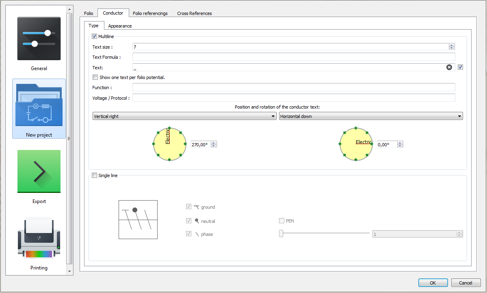

.. _en/preferences/settings_new_project

====================
New project settings
====================

QElectroTech provides the option to storage at the Data from the application some `project properties`_ 
pre-defined by the user. This feature allows the user avoiding to define many `project properties`_ 
each time that the user `creates new projects`_. 

Folio settings
~~~~~~~~~~~~~~

The **folio** tab from **New project** settings section allows pre-defining some `folio properties`_:

    * `Folio size`_.
    * `Folio title block`_.
    * `Folio default variables values`_.
    * `Folio user variables`_.

.. figure:: graphics/qet_new_project_folio_settings.png
    :align: center

    Figure: QElectroTech New project folio settings

To define folio settings: 

    1. `Display`_ QElectroTech settings PopUP window.
    2. Go to **New project** section.
    3. Go to **Folio** tab.
    4. Defien the desire parameters for each field.
    5. Press **OK** button to save the configuration changes and close settings PopUP window.

.. note::

    All pre-defined folio properties defined at QElectroTech settings PopUP window will be 
    automatically defined during `project creation`_ at `project properties`_. The `folio properties`_ 
    can be found at **Folio** tab from  **New folio** section.  

Conductor settings
~~~~~~~~~~~~~~~~~~

The **Conductor** tab from **New project** settings section allows pre-defining some `conductor properties`_:

    * `Conductor type`_ (`Multiline`_ or `Single line`_).
    * `Conductor appearance`_.

    Figure: QElectroTech New project conductor settings

To define conductor settings: 

    1. `Display`_ QElectroTech settings PopUP window.
    2. Go to **New project** section.
    3. Go to **Conductor** tab.
    4. Defien the desire parameters for each field.
    5. Press **OK** button to save the configuration changes and close settings PopUP window.

.. note::

    All pre-defined conductor properties defined at QElectroTech settings PopUP window will be 
    automatically defined during `project creation`_ at `project properties`_. The `conductor properties`_ 
    can be found at **Conductor** tab from  **New folio** section.

Folio referencings settings
~~~~~~~~~~~~~~~~~~~~~~~~~~~

The **Folio referencings** tab from **New project** settings section allows pre-defining the formula 
which should define the label variable from `Reference folio following`_ and `Previous reference folio`_.

.. figure:: graphics/qet_new_project_folio_referencings_settings.png
    :align: center

    Figure: QElectroTech New project folio referencings settings

To define folio referencings settings: 

    1. `Display`_ QElectroTech settings PopUP window.
    2. Go to **New project** section.
    3. Go to **Folio referencings** tab.
    4. Defien the desire parameters for each field.
    5. Press **OK** button to save the configuration changes and close settings PopUP window.

.. note::

    All pre-defined folio referencings properties defined at QElectroTech settings PopUP window will 
    be automatically defined during `project creation`_ at `project properties`_. The folio referencings 
    properties can be found at **Folio referencings** tab from  **New folio** section. 

Cross references settings
~~~~~~~~~~~~~~~~~~~~~~~~~

The **Cross references** tab from **New project** settings section allows pre-defining some 
`cross references properties`_:

    * Cross references type (Coil, organ of protection or Switch/button).
    * Cross references label
    * Representation position cross references label (Under the label of the element or Footer).

.. figure:: graphics/qet_new_project_cross_references_settings.png
    :align: center

    Figure: QElectroTech New project cross references settings

To define cross references settings: 

    1. `Display`_ QElectroTech settings PopUP window.
    2. Go to **New project** section.
    3. Go to **Cross references** tab.
    4. Defien the desire parameters for each field.
    5. Press **OK** button to save the configuration changes and close settings PopUP window.

.. note::

    All pre-defined cross references properties defined at QElectroTech settings PopUP window will 
    be automatically defined during `project creation`_ at `project properties`_. The cross references 
    properties can be found at **Cross references** tab from  **New folio** section.  

.. _Display: ../../en/preferences/display_settings.html
.. _Folio size: ../../en/folio/properties/folio_size.html
.. _Folio title block: ../../en/folio/properties/folio_title_block.html
.. _Folio default variables values: ../../en/folio/properties/folio_title_block.html
.. _Folio user variables: ../../en/folio/properties/folio_title_block.html
.. _Conductor type: ../../en/conductor/properties/conductor_type.html
.. _Conductor appearance: ../../en/conductor/properties/conductor_appearance.html
.. _Multiline: ../../en/conductor/type/multiline_conductor.html
.. _Single line: ../../en/conductor/type/single_line_conductor.html
.. _folio properties: ../../en/folio/properties/index.html
.. _conductor properties: ../../en/conductor/properties/index.html
.. _Reference folio following: ../../en/element/type/reference_folio_following.html
.. _Previous reference folio: ../../en/element/type/previous_reference_folio.html
.. _cross references properties: ../../en/element/properties/index.html
.. _project creation: ../../en/project/new_project.html
.. _creates new projects: ../../en/project/new_project.html
.. _project properties: ../../en/project/properties/index.html
