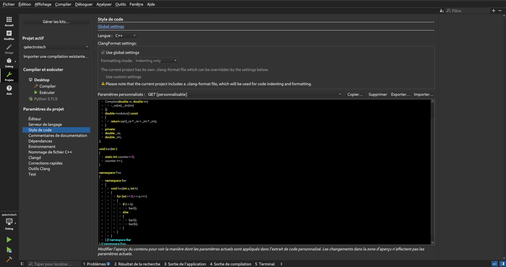

=================================
Building Qelectrotech from source
=================================

This section is for advanced users/contributors wanting to build and improve Qelectrotech (QET).

This guide assumes that you have forked the source repo and that your system has the Git VCS (Version Control System) configured to point to that fork. \
If you need help to setup Git, please take a look at the `Git Documentation <https://git-scm.com/doc>`_.

Before pushing code to the repo and creating a MR, please have a look at the [contribution guidelines](CONTRIBUTING.md).

Prerequistes
------------

-    Get sources and sub-modules

.. code-block:: bash

    git clone --recursive https://github.com/qelectrotech/qelectrotech-source-mirror.git

Linux
~~~~~

- For a Debian-like machine (Ubuntu, Linux Mint, etc), install the required packages 

.. code-block:: bash

    sudo apt install libqt5svg5-dev qt5-qmake qtbase5-dev libkf5widgetsaddons-dev libkf5coreaddons-dev libsqlite3-dev pkgconf

Environement Setup 
------------------

After installing the dependencies, install the QT Creator IDE. For that, you've got two choices:
    
    
- If you are using a bleeding edge distro like Ubuntu **non LTS**, chances are that their builds of the app are up to date. Install it by running this command:
    
.. code-block:: bash
        
    sudo apt install qt-creator
    

- If you are using a distro with a slower release cycle like Debian, you'll need to do two things:
   
  #. First setup `Flatpak <https://flathub.org/setup>`_
  #. Then use Flatpak to install the QTCreator IDE
        
.. code-block:: bash

    flatpak install flathub io.qt.QtCreator

.. _QET Coding style:

Get the QET Coding style for QTCreator and set it up.

#. First you'll want to download the corresponding XML file from . You've got two option:
        
   - Download it like a :download:`normal file <../_external/_snippets/qtcreator-qet-style.xml>` with the help of your browser (will satisfy most users)
   - Download it using an utility like curl or wget.

#. After that, you'll need to import it into the QtCreator app as shown in the picture below
    

- To produce a binary, run the .sh scripts for the different packaging options that are proposed.

Source Code Documentation
-------------------------

