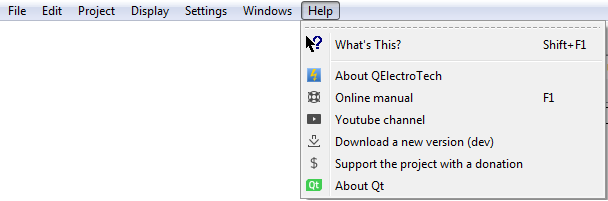

.. _en/basics/help

QElectroTech help menu
======================

QElectroTech has been designed with some tools which help the user and makes easier the searching of information. All those tools can be found at **Help** menu from `Menu bar`_.

   Figure: Help menu QElectroTech

Tooltips
~~~~~~~~

To support the user, tooltips are displayed when the mouse arrow is placed on an icon from the `Toolbars`_. A tooltip is a short message which defines the action corresponding to the icon. 

QElectroTech also allows the display from tooltips, or short descrition panels, at many different areas and objets from the main window. These panels are not diplayed automatically with the placement of the mouse arrow on the object or area. 

    1. Select **Help > What's this?** menu item.
    2. Press on the object or area to display the description panel.

.. figure:: graphics/qet_tooltip_workspace.png
   :align: center

   Figure: Message which appears at the workspace

To increase the working eficiency, the description panel can also be displayed using keyboard shortcut. The user does not need to search at the **Help** menu. 

    1. Press ``shift + f1``.
    2. Press on the object or area to display the description panel. 

.. note::

   The tool **What's this?** does not give the description from everyting, it gives only the description for the different type of collections (Title Blocks, Elements, etc.), the Workspace, Project area and a few objects and areas more.

About QElectroTech
~~~~~~~~~~~~~~~~~~

Many information related to QElectroTech can be found at the application without searching on internet. Everybody who lauchs the application can find the license text, version of the application lauched, developers and collaborators, link to the official web and many others things at **Help** menu. 

    1. Select **Help > About QElectroTech** menu item to display the PopUP window with the basic information from 
    QElectroTech project.  

Online Manual
~~~~~~~~~~~~~

**Help** menu can address the user to the official online documentation. 

    1. Select **Help > Online Manual** menu item to open the official QEletroTech online documentation at default browser.

When the application is active on the computer, the user can also open the online manual at default browser using keyboard shortcut.

    1. Press ``f1`` to open the official online manual on the browser.

.. seealso::

    For more information about QElectroTech keyboard shortcut, please refers to `Menu bar`_ section.

Youtube Channel
~~~~~~~~~~~~~~~

Many different video tutorials about QElectroTech can be found on internet. **Help** menu can address the user to the official youtube channel of the project. 

    1. Select **Help > Youtube Channel** menu item to open the QEletroTech youtube channel at default browser.

Download new version
~~~~~~~~~~~~~~~~~~~~

To download the last released version from the software, if the version launched is not the last one, **Help** menu can adreess the user to the official download page of the project.

    1. Select **Help > Download a new version** menu item to open the official QEletroTech download page at default browser.

Support the project
~~~~~~~~~~~~~~~~~~~

If the user is satisfied with the work already made by the developer team from QElectroTech and he wants to help the project with an economical donation, **Help** menu can address the user to the official paypal account of the project.

    1. Select **Help > Support the project with a donation** menu item to open the official paypal account from QEletroTech at default browser.

About Qt
~~~~~~~~

QElectroTech has been designed using `Qt`_ framework and widget toolkit. **Help** menu allows going to the official web from `Qt`_ project without the need of searching on Internet.

    1. Select **Help > About Qt** menu item to open the offical web from `Qt`_ on the browser. 

.. _Qt: https://www.qt.io/

.. _Menu bar: ../../en/interface/menu_bar.html
.. _Toolbars: ../../en/interface/toolbars.html
