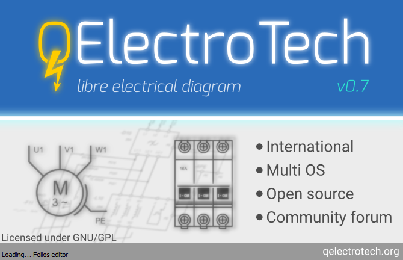

.. _en/basics/start_mac

Start QElectroTech on Mac
=========================

After installation, QElectroTech can be launched from the applications folder. 

   Figure: Starting splash screen

.. note::

   For easy access, QElectroTech can be added to the dock. Just open the Applications 
   folder and drag QEelectroTech to the dock.

Once QElectroTech has been started, the main window looks like the figure bellow.

.. figure:: graphics/qet_window.png
   :scale: 50 %
   :align: center

   Figure: Main window QElectroTech