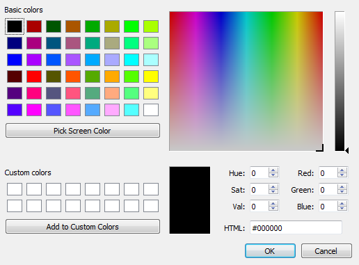

.. _en/conductor/properties/conductor_appearance

====================
Conductor appearance
====================

QElectroTech allows choosing the color, the type of line and the width from the lines. 
Exists the posibility to choose the properties for main lines and for secundary lines.

.. note::

    The secondary line is used when a dashes line with double color is desired.

        .. figure:: graphics/qet_conductor_secundary_line.png
            :align: center

            Figure: Conductor with red secundary line

.. figure:: graphics/qet_conductor_properties_appearance.png
   :align: center

   Figure: Multiline conductor appearance

On reference to the color, it can be choosed by the RGB range or using the HTML code. 

   Figure: QElectrotech select color PopUP window

On reference to the line Style, the line can be: 

    * **Solid line**
    * **Dashed line**
    * **Dots and dashes**

On reference to the width, many differen values starting from 0.4 can be choosed (0.4, 0.6, 0.8, 1.0, 
1.2, 1.4, 1.6, etc.). 

.. note::

    QElectroTech provides the option to pre-define the appearance of conductor before starting to 
    draw conductos at the folio. This feature increase the working eficiency and avoid defining the 
    appearence conductor by conductors after the creation.

    For more information about appearance pre-definition, please refers to `Folio properties`_ section.

.. _Folio properties: ../../../en/folio/properties/folio_appearance.html