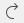
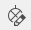

.. _en/element/element_editor/interface/menu_bar

=======================
Element editor Menu bar
=======================

The framework and widget toolkit `Qt`_ allows the design of drop-down menus. The drop-down menus 
are a characteristic graphical control element from the desktop applications. Each of the drop-down 
menus contains a number of options to initiate an action. The Menu bar is placed at top from the main 
windows. The figure bellow shows how the menu bar from QElectroTech looks.

.. figure:: graphics/qet_elementeditor_menu.png
   :align: center

   Figure: QElectroTech Element editor Menu bar

As is showed at the figure, QElectroTech element editor bar contains the Menus ``File``, ``Edit``, 
``Display``, ``Settings`` and ``Help``.

|

+------------+------------------------------------+-----------------------------------------------------------------------+---------------------------+----------------+
| Menu       | Options                            | Function                                                              | Keyboard shortcut         | Toolbar icon   |
+============+====================================+=======================================================================+===========================+================+
| **File**   | New                                | Creates a new Element                                                 |   ``Ctrl + n``            | |icon_new|     |
+            +------------------------------------+-----------------------------------------------------------------------+---------------------------+----------------+
|            | Open                               | Opens an existing element from a library                              |   ``Ctrl + o``            | |icon_open|    |
+            +------------------------------------+-----------------------------------------------------------------------+---------------------------+----------------+
|            | Open from a file                   | Opens an existing element from the disk                               |   ``Ctrl + Shift + o``    |                |
+            +------------------------------------+-----------------------------------------------------------------------+---------------------------+----------------+
|            | Starting the DXF converter pluging |                                                                       |                           |                |
+            +------------------------------------+-----------------------------------------------------------------------+---------------------------+----------------+
|            | Recently opened                    | Open an element from history (recently opened files)                  |                           |                |
+            +------------------------------------+-----------------------------------------------------------------------+---------------------------+----------------+
|            | Save                               | Saves the current Element changes (overwrites)                        |   ``Ctrl + s``            | |icon_save|    |
+            +------------------------------------+-----------------------------------------------------------------------+---------------------------+----------------+
|            | Save as                            | Saves the Element as a new element from a library                     |                           | |icon_save_as| |
+            +------------------------------------+-----------------------------------------------------------------------+---------------------------+----------------+
|            | Save to a file                     | Saves the Element as a different file on disk                         |   ``Ctrl + Shift + s``    |                |
+            +------------------------------------+-----------------------------------------------------------------------+---------------------------+----------------+
|            | Reload                             | Reloads the opened element (all changes which are not saved are lost) |   ``f5``                  | |icon_reload|  |
+            +------------------------------------+-----------------------------------------------------------------------+---------------------------+----------------+
|            | Quit                               |  Quits QElectroTech Element editor                                    | ``Ctrl + q``/ ``Alt + F4``|                |
+------------+------------------------------------+-----------------------------------------------------------------------+---------------------------+----------------+

|

+--------------+-------------------------------------------+-------------------------------------------------------------+---------------------------+-------------------+
| Menu         | Options                                   | Function                                                    | Keyboard shortcut         | Toolbar icon      |
+==============+===========================================+=============================================================+===========================+===================+
| **Edit**     |  Undo                                     | Undo the last action at the element editor                  |  ``Ctrl + z``             | |icon_undo|       |
+              +-------------------------------------------+-------------------------------------------------------------+---------------------------+-------------------+
|              |  Redo                                     | Recovers the last undo action at the element editor         |  ``Ctrl + y``             | |icon_redo|       |
+              +-------------------------------------------+-------------------------------------------------------------+---------------------------+-------------------+
|              |  Select All                               | Selects all parts from the element                          |  ``Ctrl + a``             |                   |
+              +-------------------------------------------+-------------------------------------------------------------+---------------------------+-------------------+
|              |  Select none                              | Unselects all current selected parts in the element         |  ``Ctrl + Shift + a``     |                   |
+              +-------------------------------------------+-------------------------------------------------------------+---------------------------+-------------------+
|              |  Invert selection                         | Inverts selection of element parts                          |  ``Ctrl + i``             |                   |
+              +-------------------------------------------+-------------------------------------------------------------+---------------------------+-------------------+
|              |  Cut                                      | Equivalent to copy + delete element part/s                  |  ``Ctrl + x``             |                   |
+              +-------------------------------------------+-------------------------------------------------------------+---------------------------+-------------------+
|              |  Copy                                     | Copies the selected element part/s                          |  ``Ctrl + c``             |                   |
+              +-------------------------------------------+-------------------------------------------------------------+---------------------------+-------------------+
|              |  Paste                                    | Pastes the parts from last copy or cut                      |  ``Ctrl + v``             |                   |
+              +-------------------------------------------+-------------------------------------------------------------+---------------------------+-------------------+
|              |  Paste in the area                        | Pastes the object from last copy or cut in a selected area  |  ``Ctrl + Shift + v``     |                   |
+              +-------------------------------------------+-------------------------------------------------------------+---------------------------+-------------------+
|              |  Paste from                               |                                                             |                           |                   |
+              +-------------------------------------------+-------------------------------------------------------------+---------------------------+-------------------+
|              |  Delete                                   | Deletes the selected element/s part/s                       |  ``Del``                  | |icon_delete|     |
+              +-------------------------------------------+-------------------------------------------------------------+---------------------------+-------------------+
|              |  Edit name and information of the element | Displays the element Edit names PopUp window                |  ``Ctrl + y``             ||icon_element_info||
+              +-------------------------------------------+-------------------------------------------------------------+---------------------------+-------------------+
|              |  Edit author information                  | Displays the element Edit author informaton PopUp window    |                           ||icon_element_prop||
+              +-------------------------------------------+-------------------------------------------------------------+---------------------------+-------------------+
|              |  Edit element properties                  | Displays the element property PopUp window                  |                           |                   |
+              +-------------------------------------------+-------------------------------------------------------------+---------------------------+-------------------+
|              |  Bring to front                           | Selected element part sent at top                           |  ``Ctrl + Shift + Home``  | |icon_bring_front||
+              +-------------------------------------------+-------------------------------------------------------------+---------------------------+-------------------+
|              |  Raise                                    | Selected element part sent one level up                     |  ``Ctrl + Shift + Up``    | |icon_raise|      |
+              +-------------------------------------------+-------------------------------------------------------------+---------------------------+-------------------+
|              |  Lower                                    | Selected element part sent one level down                   |  ``Ctrl + Shift + Down``  | |icon_lower|      |
+              +-------------------------------------------+-------------------------------------------------------------+---------------------------+-------------------+
|              |  Send backwards                           | Selected element part sent at bottom                        |  ``Ctrl + Shift + End`    | |icon_backward|   |
+--------------+-------------------------------------------+-------------------------------------------------------------+---------------------------+-------------------+

|

+----------------+--------------------------------+--------------------------------------------------------------------------------------------+------------------------+-------------------+
| Menu           | Options                        | Function                                                                                   | Keyboard shortcut      | Toolbar icon      |
+================+================================+============================================================================================+========================+===================+
| **Display**    | Zoom In                        | Magnify the Element symbol for a closer view                                               |  ``Ctrl + +``          |                   |
+                +--------------------------------+--------------------------------------------------------------------------------------------+------------------------+-------------------+
|                | Zoom Out                       | Reduce magnification of the Element symbol; develops a distant view of the Element         |  ``Ctrl + -``          |                   |
+                +--------------------------------+--------------------------------------------------------------------------------------------+------------------------+-------------------+
|                | Fit in view                    | Define zoom level to fit the Element symbol at workspace                                   |  ``Ctrl + 9``          ||icon_fit_in_view| |
+                +--------------------------------+--------------------------------------------------------------------------------------------+------------------------+-------------------+
|                | Reset zoom                     | Reset zoom levels to default value (zoom level just less than that of fit in view)         |  ``Ctrl + 0``          ||icon_reset_zoom|  |
+----------------+--------------------------------+--------------------------------------------------------------------------------------------+------------------------+-------------------+

|

+---------------+--------------------------------+-------------------------------------------------+-------------------------------+--------------------------------------------------+-------------------+
| Menu          | Options                        | Function                                        | Keyboard shortcut             | Notes                                            | Toolbar icon      |
+===============+================================+=================================================+===============================+==================================================+===================+
| **Settings**  | Display                        | Display or hide toolbars and panels             |                               | Hides or shows elements panel, tool bar etc.,    |                   |
+               +--------------------------------+-------------------------------------------------+-------------------------------+--------------------------------------------------+-------------------+
|               | Full screen mode               | Spreads the window to fill the screen           |  ``Ctrl + Shift + f``         | Entire screen gets occupied by the window        |                   |
+               +--------------------------------+-------------------------------------------------+-------------------------------+--------------------------------------------------+-------------------+
|               | Configure QElectroTech         | Display QElectroTech configure PopUp window     |                               |                                                  |                   |
+---------------+--------------------------------+-------------------------------------------------+-------------------------------+--------------------------------------------------+-------------------+

|

+---------------+-------------------------------------+---------------------------------------------------------------------------------------+---------------------------+-------------------+
| Menu          | Options                             | Function                                                                              | Keyboard shortcut         | Toolbar icon      |
+===============+=====================================+=======================================================================================+===========================+===================+
| **Help**      | What's This?                        | Enquires main menu options                                                            | ``Shift + f1``            |                   |
+               +-------------------------------------+---------------------------------------------------------------------------------------+---------------------------+-------------------+
|               | About QElectroTech                  | Displays information about authors, contributors, translators and Licensing           |                           |                   |
+               +-------------------------------------+---------------------------------------------------------------------------------------+---------------------------+-------------------+
|               | Online manual                       | Opens the explorer and redirects to the official QElectroTech documentation           | ``f1``                    |                   |
+               +-------------------------------------+---------------------------------------------------------------------------------------+---------------------------+-------------------+
|               | Youtube channel                     | Opens the explorer and redirects to the official QElectroTech Youtube channel         |                           |                   |
+               +-------------------------------------+---------------------------------------------------------------------------------------+---------------------------+-------------------+
|               | Download a new version (dev)        | Opens the explorer and redirects to the official QElectroTech download link           |                           |                   |
+               +-------------------------------------+---------------------------------------------------------------------------------------+---------------------------+-------------------+
|               | Support the project with a donation | Opens the explorer and redirects to the official QElectroTech donation paypal account |                           |                   |
+               +-------------------------------------+---------------------------------------------------------------------------------------+---------------------------+-------------------+
|               | About Qt                            | Displays information about `Qt`_, a C++ toolkit for cross platform applications       |                           |                   |
+---------------+-------------------------------------+---------------------------------------------------------------------------------------+---------------------------+-------------------+

.. _Qt: https://www.qt.io/

.. |icon_new| image:: graphics/qet_new_icon.png
.. |icon_open| image:: graphics/qet_editor_open_icon.png
.. |icon_save| image:: graphics/qet_toolbar_save.png
.. |icon_save_as| image:: graphics/qet_toolbar_save_as.png
.. |icon_reload| image:: graphics/qet_reload_icon.png
.. |icon_undo| image:: graphics/qet_undo_icon.png

.. |icon_element_info| image:: graphics/qet_element_name_and_information_icon.png

.. |icon_bring_front| image:: graphics/qet_bring_front_icon.png
.. |icon_raise| image:: graphics/qet_raise_icon.png
.. |icon_lower| image:: graphics/qet_lower_icon.png

.. |icon_fit_in_view| image:: graphics/qet_fit_in_view_icon.png
.. |icon_reset_zoom| image:: graphics/qet_reset_zoom_icon.png