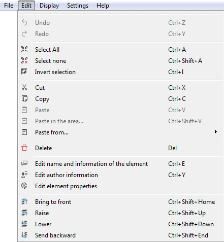

.. _en/element/elementeditor/edition/pasteinarea

=============
Paste in area
=============

Past in are is similar command to paste part, the main diference is the place where the part can be pasted.
At normal paste command QElectroTech pastes the part automatically at a predefined position, at paste in area 
command the user is free to choose the place where to paste the object by left clik on the desired place.

Pasting parts in area can be done from the Menu bar, by right click on the workspace and from the corresponding 
keyboard shortcut.

Paste part from Menu bar
~~~~~~~~~~~~~~~~~~~~~~~~~~~

    1. Select **Edit > Paste in the area...** menu item to paste the part copied or cut previously from the workspace.
    2. Left click at the workspace point where the part should be pasted.  

   Figure: QElectroTech Edit menu

Paste part by right click
~~~~~~~~~~~~~~~~~~~~~~~~~~~~

    1. Right click somewhere from the workspace area.
    2. Select the option **Paste in the area...** to paste the part copied or cut previously.
    3. Left click at the workspace point where the part should be pasted.

.. figure:: graphics/qet_element_editor_right_click.png
   :align: center

   Figure: QElectroTech right click PopUP window

Paste part using keyboard shortcut
~~~~~~~~~~~~~~~~~~~~~~~~~~~~~~~~~~~~~

As many other tools, QElectroTech is an applications which allows using keyboard shortcut.

    1. Press ``Ctrl + Shift + v`` to paste the part copied or cut previously from the workspace.
    2. Left click at the workspace point where the part should be pasted.  

For more information about keyboard shortcut, please refers to **keyboard shortcut** section.