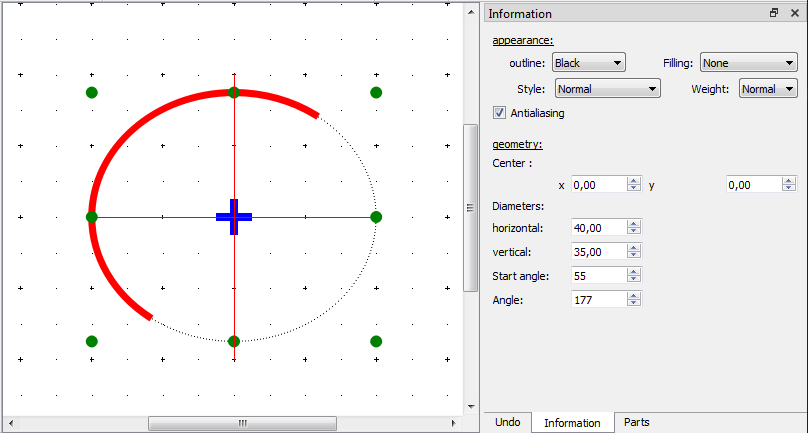

.. _en/element/elementeditor/elementparts/arc

===
Arc
===

Create arc
##########

The arc can only be added to the workspace by the tool bar.

    1. Select the icon |icon_arc| from the toolbar to add an arc.
    2. Click at the workspace the position from the start point of the arc.
    3. Click at the workspace the position from on end point of the arc. The default arc has always an angle of 90 degrees.

.. |icon_arc| image:: graphics/qet_arc_icon.png

.. note::

   If the toolbar is not displayed, it can be displayed from **Settings > Display > Parts**.

Arc properties
##############

The properties from every element part can only be displayed at the properties panel when the part is 
selected.

.. note::

   If the toolbar is not displayed, it can be displayed from **Settings > Display > Information**.

   Figure: QElectroTech arc part from element

QElectroTech allows customizing different arc properties:

:Appearence:

    :Color:

        The outline color and the filling color of the part can be defined from a list of 
        pre-defined colors. At the case of the arc part the filling color is **None**.

    :Style:

        The type of outline representation can be choosed from the following options: Normal 
        (Continuous), Dashed, Dotted or, Dots and dashes. 

    :Thickness:

        The thikness (Weight) from the outline can be choosed between: None, Thin, Normal, Strong 
        or High.

:Geometry:

    :Coordenates:

        The coordinates (x, y) from the ellipse center point can be defined.

    :Dimensions:

        The horizontal and vertical (minimum and maximum or maximum and minimum) diameters from the ellipse can be defined.
    
    :Point:

        The position of initial point and end point are defined as angle of the radius betuen the center and the respective point with the horizontal diameter. The angle value follows the mathematical rules, anti-clockwise for positive angles.

Arc extreme points definition
#############################

QElectroTech allows defining the arc extreme points at the information panel or at the workspace.

.. figure:: graphics/qet_element_arc_extreme.png
   :align: center

   Figure: QElectroTech arc extreme point

Arc extreme points definition from information panel
~~~~~~~~~~~~~~~~~~~~~~~~~~~~~~~~~~~~~~~~~~~~~~~~~~~~

    1. Select the arc to display the rectangle properties at the information panel.
    2. Define the start angle, the angle from the diamete of the start point and the horizontal axes.
    3. Define the angle from the initial point and the end point of the arc.
    4. Press intro.

Arc extreme points definition from workspace
~~~~~~~~~~~~~~~~~~~~~~~~~~~~~~~~~~~~~~~~~~~~

    1. Select the arc drawn at the workspace. The arc line changes to red color and the control of the arc ellipse point to blue.
    2. Select the arc again. The line continues in red and the points will change to green color.
    3. Select the arc for third time. The line continues in red and at this time only one extreme points are, the color is pink.
    4. Displace the pink points arround the ellipse outline.