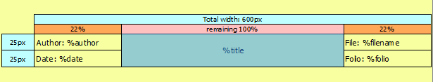

.. _en/folio/titleblock/titleblockeditor/interface/workspace

Drawing area
============

The drawing area or grafical editor, is the area where the title block collumns a cells are created. 

At the figure bellow, how looks the drawing area from the title block editor can be found. 

   Figure: QElectroTech title block grafical editor