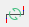

.. _en/interface/menu_bar

========
Menu bar
========

The framework and widget toolkit `Qt`_ allows the design of drop-down menus. The drop-down menus 
are a characteristic graphical control element from the desktop applications. Each of the drop-down 
menus contains a number of options to initiate an action. The Menu bar is placed at top from the main 
windows. The figure bellow shows how the menu bar from QElectroTech looks.

.. figure:: graphics/qet_menu_bar.png
   :align: center

   Figure: QElectroTech Menu bar

As is showed at the figure, QElectroTech bar contains the menus ``File``, ``Edit``, ``Project``, 
``Display``, ``Settings``, ``Windows`` and ``Help``. A brief description of each such option can 
be read from `Help or Information tool bar`_ by hovering over the option with the cursor. The 
following tables summarizes the available options from the main Menu bar.

|

+------------+------------------+------------------------------------------------------------------+---------------------------+----------------+
| Menu       | Options          | Function                                                         | Keyboard shortcut         | Toolbar icon   |
+============+==================+==================================================================+===========================+================+
| **File**   | Latest files     | Open a project from history (recently opened files)              |                           |                |
+            +------------------+------------------------------------------------------------------+---------------------------+----------------+
|            | New              | Creates a new Project                                            |   ``Ctrl + n``            | |icon_new|     |
+            +------------------+------------------------------------------------------------------+---------------------------+----------------+
|            | Open             | Opens an existing project from the disk                          |   ``Ctrl + o``            | |icon_open|    |
+            +------------------+------------------------------------------------------------------+---------------------------+----------------+
|            | Save             | Saves the current changes to the project (overwrites)            |   ``Ctrl + s``            | |icon_save|    |
+            +------------------+------------------------------------------------------------------+---------------------------+----------------+
|            | Save as          | Saves the current project as a different file on disk            |                           | |icon_save_as| |
+            +------------------+------------------------------------------------------------------+---------------------------+----------------+
|            | Close            | Closes the current project (prompts for saving changes)          |   ``Ctrl + w``            | |icon_close|   |
+            +------------------+------------------------------------------------------------------+---------------------------+----------------+
|            | Export           |  Opens a dialogue to export drawings from a project              |   ``Ctrl + Shift + x``    |                | 
+            +------------------+------------------------------------------------------------------+---------------------------+----------------+
|            | Print            |  Opens a dialogue to print drawings from a project               |   ``Ctrl + p``            |  |icon_print|  |
+            +------------------+------------------------------------------------------------------+---------------------------+----------------+
|            | Quit             |  Quits the QElectroTech main window (prompts for saving changes) | ``Ctrl + q``/ ``Alt + F4``|                |
+------------+------------------+------------------------------------------------------------------+---------------------------+----------------+

|

+--------------+---------------------------+-------------------------------------------------------------+---------------------------+-------------------+
| Menu         | Options                   | Function                                                    | Keyboard shortcut         | Toolbar icon      |
+==============+===========================+=============================================================+===========================+===================+
| **Edit**     |  Undo                     | Undo the last action in the active drawing (folio)          |  ``Ctrl + z``             | |icon_undo|       |
+              +---------------------------+-------------------------------------------------------------+---------------------------+-------------------+
|              |  Redo                     | Recovers the last undo action in the active drawing (folio) |  ``Ctrl + y``             | |icon_redo|       |
+              +---------------------------+-------------------------------------------------------------+---------------------------+-------------------+
|              |  Cut                      | Equivalent to copy + delete the object (active folio)       |  ``Ctrl + x``             | |icon_cut|        |
+              +---------------------------+-------------------------------------------------------------+---------------------------+-------------------+
|              |  Copy                     | Copies the object selected in the active drawing            |  ``Ctrl + c``             | |icon_copy|       |
+              +---------------------------+-------------------------------------------------------------+---------------------------+-------------------+
|              |  Paste                    | Pastes the object from last copy or cut (any folio)         |  ``Ctrl + v``             | |icon_paste|      |
+              +---------------------------+-------------------------------------------------------------+---------------------------+-------------------+
|              |  Select All               | Selects all objects in the active drawing area              |  ``Ctrl + a``             |                   |
+              +---------------------------+-------------------------------------------------------------+---------------------------+-------------------+
|              |  Select none              | Removes all current selections in the active folio          |                           |                   |
+              +---------------------------+-------------------------------------------------------------+---------------------------+-------------------+
|              |  Invert selection         | Inverts selection of objects in the active folio            |  ``Ctrl + i``             |                   |
+              +---------------------------+-------------------------------------------------------------+---------------------------+-------------------+
|              |  Delete                   | Deletes the selected object in the active folio             |  ``Del``                  | |icon_delete|     |
+              +---------------------------+-------------------------------------------------------------+---------------------------+-------------------+
|              |  Rotate                   | Rotates selected object(s) in the active folio              |  ``Space``                | |icon_rotate|     |
+              +---------------------------+-------------------------------------------------------------+---------------------------+-------------------+
|              |  Choose texts orientation | Rotates selected text field(s) in the active folio          |  ``Ctrl + Space``         |                   |
+              +---------------------------+-------------------------------------------------------------+---------------------------+-------------------+
|              |  Find in the panel        | Identifies the selected element in elements panel           |                           |                   |
+              +---------------------------+-------------------------------------------------------------+---------------------------+-------------------+
|              |  Edit the selected item   | Opens properties window for the selected element            |  ``Ctrl + e``             |                   |
+              +---------------------------+-------------------------------------------------------------+---------------------------+-------------------+
|              |  Group selected texts     |                                                             |                           |                   |
+              +---------------------------+-------------------------------------------------------------+---------------------------+-------------------+
|              |  Reset conductors         | Resets selected conductor(s) to a shortest path             |  ``Ctrl + k``             | |icon_reset|      |
+              +---------------------------+-------------------------------------------------------------+---------------------------+-------------------+
|              |  Folio properties         | Opens the properties window for the active drawing          |  ``Ctrl + l``             | |icon_folio_prop| |
+              +---------------------------+-------------------------------------------------------------+---------------------------+-------------------+
|              |  Add a column             | Adds an additional column to the active drawing             |                           |                   |
+              +---------------------------+-------------------------------------------------------------+---------------------------+-------------------+
|              |  Remove a column          | Removes a column from the active drawing                    |                           |                   |
+              +---------------------------+-------------------------------------------------------------+---------------------------+-------------------+
|              |  Add a row                | Adds an additional row to the active drawing                |                           |                   |
+              +---------------------------+-------------------------------------------------------------+---------------------------+-------------------+
|              |  Remove a row             | Removes a row from the active drawing                       |                           |                   |
+              +---------------------------+-------------------------------------------------------------+---------------------------+-------------------+
|              |  Bring to front           | Selected object sent at top                                 |  ``Ctrl + Shift + Home``  | |icon_bring_front||
+              +---------------------------+-------------------------------------------------------------+---------------------------+-------------------+
|              |  Raise                    | Selected object sent one level up                           |  ``Ctrl + Shift + Up``    | |icon_raise|      |
+              +---------------------------+-------------------------------------------------------------+---------------------------+-------------------+
|              |  Lower                    | Selected object sent one level down                         |  ``Ctrl + Shift + Down``  | |icon_lower|      |
+              +---------------------------+-------------------------------------------------------------+---------------------------+-------------------+
|              |  Send backwards           | Selected object sent at bottom                              |  ``Ctrl + Shift + End`    | |icon_backward|   |
+              +---------------------------+-------------------------------------------------------------+---------------------------+-------------------+
|              |  Search / Replace         | Display Search / Replace panel                              |  ``Ctrl + f``             |                   |
+--------------+---------------------------+-------------------------------------------------------------+---------------------------+-------------------+

|

+----------------+--------------------------------------------+------------------------------------------------------------------------------------------+------------------------+-------------------+
| Menu           | Options                                    | Function                                                                                 | Keyboard shortcut      | Toolbar icon      |
+================+============================================+==========================================================================================+========================+===================+
| **Project**    | Project properties                         | Display project properties PopUp window                                                  |                        |                   |
+                +--------------------------------------------+------------------------------------------------------------------------------------------+------------------------+-------------------+
|                | Add a folio                                | Adds a new folio (drawing sheet) to the active project.                                  |  ``Ctrl + t``          | |icon_add_folio|  |
+                +--------------------------------------------+------------------------------------------------------------------------------------------+------------------------+-------------------+
|                | Delete this folio                          | Deletes the active folio (drawing sheet) of the project                                  |                        |                   |
+                +--------------------------------------------+------------------------------------------------------------------------------------------+------------------------+-------------------+
|                | Clean project                              | Purges the active project of unused elements and empty categories and templates          |                        |                   |
+                +--------------------------------------------+------------------------------------------------------------------------------------------+------------------------+-------------------+
|                | Add a summary                              | Creates an index folio for the active project                                            |                        |                   |
+                +--------------------------------------------+------------------------------------------------------------------------------------------+------------------------+-------------------+
|                | Export parts list                          | Generates a ``.csv`` file summary of all elements used in the active project             |                        |                   |
+                +--------------------------------------------+------------------------------------------------------------------------------------------+------------------------+-------------------+
|                | Launch the terminal block creation pluging |                                                                                          |                        |                   |
+----------------+--------------------------------------------+------------------------------------------------------------------------------------------+------------------------+-------------------+

|

+----------------+--------------------------------+--------------------------------------------------------------------------------------------+------------------------+-------------------+
| Menu           | Options                        | Function                                                                                   | Keyboard shortcut      | Toolbar icon      |
+================+================================+============================================================================================+========================+===================+
| **Display**    | Display projects               | Set preference for projects and folios appearance as either tabs (default) or windows      |                        |                   |
+                +--------------------------------+--------------------------------------------------------------------------------------------+------------------------+-------------------+
|                | Select                         | Use choose tool (default) to select individual elements, conductors in the workspace       |                        | |icon_select|     |
+                +--------------------------------+--------------------------------------------------------------------------------------------+------------------------+-------------------+
|                | Move                           | Use move tool to hold and drag the drawing sheet (folio) when zoomed in excess of display  |                        | |icon_move|       |
+                +--------------------------------+--------------------------------------------------------------------------------------------+------------------------+-------------------+
|                | Display the grid               | Display / hidden workspace grid                                                            |                        | |icon_grid|       |
+                +--------------------------------+--------------------------------------------------------------------------------------------+------------------------+-------------------+
|                | Background color white / gray  | Change workspace background from white to gray or vice versa                               |                        | |icon_background| |
+                +--------------------------------+--------------------------------------------------------------------------------------------+------------------------+-------------------+
|                | Zoom In                        | Magnify the drawing for a closer view; (use move tool to drag the folio to view all parts) |  ``Ctrl + +``          |                   |
+                +--------------------------------+--------------------------------------------------------------------------------------------+------------------------+-------------------+
|                | Zoom Out                       | Reduce magnification of the drawing; develops a distant view of the folio                  |  ``Ctrl + -``          |                   |
+                +--------------------------------+--------------------------------------------------------------------------------------------+------------------------+-------------------+
|                | Zoom content                   | The window magnifies to a level that fits all the elements of the active folio to display  |  ``Ctrl + 8``          ||icon_zoom_content||
+                +--------------------------------+--------------------------------------------------------------------------------------------+------------------------+-------------------+
|                | Fit in view                    | Define zoom level to fit the active folio at workspace, including grid and title block     |  ``Ctrl + 9``          ||icon_fit_in_view| |
+                +--------------------------------+--------------------------------------------------------------------------------------------+------------------------+-------------------+
|                | Reset zoom                     | Reset zoom levels to default value (zoom level just less than that of fit in view)         |  ``Ctrl + 0``          ||icon_reset_zoom|  |
+----------------+--------------------------------+--------------------------------------------------------------------------------------------+------------------------+-------------------+

|

+---------------+--------------------------------+-------------------------------------------------+-------------------------------+--------------------------------------------------+-------------------+
| Menu          | Options                        | Function                                        | Keyboard shortcut             | Notes                                            | Toolbar icon      |
+===============+================================+=================================================+===============================+==================================================+===================+
| **Settings**  | Display                        | Display or hide toolbars and panels             |                               | Hides or shows elements panel, tool bar etc.,    |                   |
+               +--------------------------------+-------------------------------------------------+-------------------------------+--------------------------------------------------+-------------------+
|               | Full screen mode               | Spreads the window to fill the screen           |  ``Ctrl + Shift + f``         | Entire screen gets occupied by the window        |                   |
+               +--------------------------------+-------------------------------------------------+-------------------------------+--------------------------------------------------+-------------------+
|               | Configure QElectroTech         | Display QElectroTech configure PopUp window     |                               |                                                  |                   |
+---------------+--------------------------------+-------------------------------------------------+-------------------------------+--------------------------------------------------+-------------------+

|

+----------------+--------------------------------+-----------------------------------------------------------------------------------------------+-------------------------------+-------------------+
| Menu           | Options                        | Function                                                                                      | Keyboard shortcut             | Toolbar icon      |
+================+================================+===============================================================================================+===============================+===================+
| **Windows**    | Close                          | Closes the current project (prompts for saving changes)                                       |  ``Ctrl + f4``                | |icon_close|      |
+                +--------------------------------+-----------------------------------------------------------------------------------------------+-------------------------------+-------------------+
|                | Tile                           | Adds a new drawing sheet to the active project. (Folio means drawing sheet)                   |                               |                   |
+                +--------------------------------+-----------------------------------------------------------------------------------------------+-------------------------------+-------------------+
|                | Cascade                        | Deletes the active drawing of the project                                                     |                               |                   |
+                +--------------------------------+-----------------------------------------------------------------------------------------------+-------------------------------+-------------------+
|                | Next Project                   | Purges the active project of unused elements and empty categories and templates               |  ``Ctrl + tab``               |                   |
+                +--------------------------------+-----------------------------------------------------------------------------------------------+-------------------------------+-------------------+
|                | Previous Project               | Creates an index folio for the active project                                                 |  ``Ctrl + Shift + Backtab``   |                   |
+                +--------------------------------+-----------------------------------------------------------------------------------------------+-------------------------------+-------------------+
|                | (Opened Projects)              | Below **Previous Project** QElectroTech list all opened projects to select the active project |                               |                   |
+----------------+--------------------------------+-----------------------------------------------------------------------------------------------+-------------------------------+-------------------+

|

+---------------+-------------------------------------+---------------------------------------------------------------------------------------+---------------------------+-------------------+
| Menu          | Options                             | Function                                                                              | Keyboard shortcut         | Toolbar icon      |
+===============+=====================================+=======================================================================================+===========================+===================+
| **Help**      | What's This?                        | Enquires main menu options                                                            | ``Shift + f1``            |                   |
+               +-------------------------------------+---------------------------------------------------------------------------------------+---------------------------+-------------------+
|               | About QElectroTech                  | Displays information about authors, contributors, translators and Licensing           |                           |                   |
+               +-------------------------------------+---------------------------------------------------------------------------------------+---------------------------+-------------------+
|               | Online manual                       | Opens the explorer and redirects to the official QElectroTech documentation           | ``f1``                    |                   |
+               +-------------------------------------+---------------------------------------------------------------------------------------+---------------------------+-------------------+
|               | Youtube channel                     | Opens the explorer and redirects to the official QElectroTech Youtube channel         |                           |                   |
+               +-------------------------------------+---------------------------------------------------------------------------------------+---------------------------+-------------------+
|               | Download a new version (dev)        | Opens the explorer and redirects to the official QElectroTech download link           |                           |                   |
+               +-------------------------------------+---------------------------------------------------------------------------------------+---------------------------+-------------------+
|               | Support the project with a donation | Opens the explorer and redirects to the official QElectroTech donation paypal account |                           |                   |
+               +-------------------------------------+---------------------------------------------------------------------------------------+---------------------------+-------------------+
|               | About Qt                            | Displays information about `Qt`_, a C++ toolkit for cross platform applications       |                           |                   |
+---------------+-------------------------------------+---------------------------------------------------------------------------------------+---------------------------+-------------------+

.. _Qt: https://www.qt.io/

.. _Help or Information tool bar: ../../en/interface/help_bar.html

.. |icon_new| image:: graphics/qet_toolbar_new.png

.. |icon_save| image:: graphics/qet_toolbar_save.png
.. |icon_save_as| image:: graphics/qet_toolbar_save_as.png
.. |icon_close| image:: graphics/qet_toolbar_close.png
.. |icon_print| image:: graphics/qet_print_icon.png
.. |icon_undo| image:: graphics/qet_undo_icon.png
.. |icon_redo| image:: graphics/qet_redo_icon.png
.. |icon_cut| image:: graphics/qet_cut_icon.png

.. |icon_delete| image:: graphics/qet_delete_icon.png
.. |icon_paste| image:: graphics/qet_paste_icon.png
.. |icon_rotate| image:: graphics/qet_rotate_icon.png

.. |icon_folio_prop| image:: graphics/qet_folio_prop_icon.png
.. |icon_bring_front| image:: graphics/qet_bring_front_icon.png
.. |icon_raise| image:: graphics/qet_raise_icon.png

.. |icon_backward| image:: graphics/qet_backward_icon.png
.. |icon_add_folio| image:: graphics/qet_folio_tab_add_folio.png

.. |icon_move| image:: graphics/qet_move_icon.png
.. |icon_grid| image:: graphics/qet_grid_icon.png
.. |icon_background| image:: graphics/qet_background_color_icon.png
.. |icon_zoom_content| image:: graphics/qet_zoom_content_icon.png
.. |icon_fit_in_view| image:: graphics/qet_fit_in_view_icon.png
.. |icon_reset_zoom| image:: graphics/qet_reset_zoom_icon.png