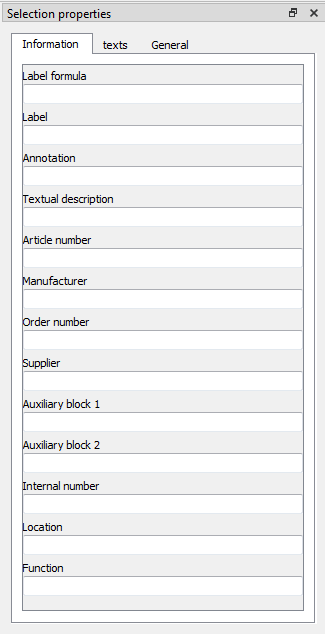

.. _en/interface/panels/selection_properties_panel

==========================
Selection properties panel
==========================

The Selection properties panel displays the properties from the selecte object. Only the properties 
from some object can be displayed at the panel. The Selection properties panel can display the 
properties from the following objects:

    * `Elements`_
    * Some `Basic objects`_: `Line`_, `Rectangle`_, `Ellipse`_, `Polygon`_ and `Picture`_.

   Figure: QElectroTech Selection properties panel

To display the Selection properties panel:

    1. Select **Settings > display > Selection properties** menu item to display the Selection properties panel.

The main fucntion of the Selection properties panel is to manage the object properties. At QElectroTech, 
the object properties can be different for each object, for this reason many different actionas can be 
made from this panel. Bellow are listed the most important tasks able from the projehct panel:

    * Manage the properties from the basic geometrical objects (`Line`_, `Rectangle`_, `Ellipse`_ and `Polygon`_). 
    * Define the scale from the imported `Pictures`_.
    * Lock the position of the `Basic objects`_ (`Line`_, `Rectangle`_, `Ellipse`_, `Polygon`_ and `Picture`_).
    * Manage the information from the elements (Label, Fucntion, Manufacturer, Article number, Order number, etc.).
    * Manage the Text and Dynamic text from element symbol.
    * Display the general element properties (Element Name, Position, Dimensions, Number of terminals, etc.).
    * Manage the element links (Cross references).

.. _Elements: ../../../en/element/index.html
.. _Basic objects: ../../../en/schema/basics/index.html
.. _Line: ../../../en/schema/basics/line.html
.. _Rectangle: ../../../en/schema/basics/rectangle.html
.. _Ellipse: ../../../en/schema/basics/ellipse.html
.. _Polygon: ../../../en/schema/basics/polygon.html
.. _Picture: ../../../en/schema/picture.html
.. _Pictures: ../../../en/schema/picture.html