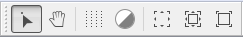
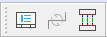
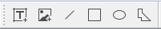

.. _en/interface/toolbars

Toolbars
========

In addition to the different `Menus`_, QElectroTech also provides toolbars. The toolbars are 
groups of buttons with icons which initiate accions. In general, these buttons have its 
counterpart at one of the menus from the `Menu bar`_. The aim from the toolbars is to make 
easier and more grafically the use of QElectroTech. 

The different toolbars can be hidden or placed in one or more rows bellow `Menu bar`_. The toolbars 
can also be placed on column at the left or right side from the main window.

.. note::

   To help the user, a tooltip is displayed when the arrow is placed on each button.

Toolbar Tools
~~~~~~~~~~~~~

.. figure:: graphics/qet_toolbar_tools.png
   :align: center

   Figure: QElectroTech toolbar Tools 

The different button from toolbar **Tools** are mentioned and described bellow. 

+------------+------------------+------------------------------------------------------------------+---------------------------+----------------+
| Toolbar    | Options          | Function                                                         | Keyboard shortcut         | Toolbar icon   |
+============+==================+==================================================================+===========================+================+
| **Tools**  | New              | Creates a new Project                                            |                           | |icon_new|     |
+            +------------------+------------------------------------------------------------------+---------------------------+----------------+
|            | Open             | Opens an existing project from the computer                      |   ``Ctrl + o``            | |icon_open|    | 
+            +------------------+------------------------------------------------------------------+---------------------------+----------------+
|            | Save             | Saves the current changes to the project (overwrites)            |   ``Ctrl + s``            | |icon_save|    |
+            +------------------+------------------------------------------------------------------+---------------------------+----------------+
|            | Save as          | Saves the current project as a different file on disk            |                           | |icon_save_as| |
+            +------------------+------------------------------------------------------------------+---------------------------+----------------+
|            | Close            | Closes the current project (prompts for saving changes)          |   ``Ctrl + w``            | |icon_close|   |
+            +------------------+------------------------------------------------------------------+---------------------------+----------------+
|            | Print            | Opens a dialogue to print drawings from a project                |   ``Ctrl + p``            |  |icon_print|  |
+            +------------------+------------------------------------------------------------------+---------------------------+----------------+
|            |  Undo            | Undo the last action in the active drawing (folio)               |  ``Ctrl + z``             | |icon_undo|    |
+            +------------------+------------------------------------------------------------------+---------------------------+----------------+
|            |  Redo            | Repeat the last action in the active drawing (folio)             |  ``Ctrl + Shift + z``     | |icon_redo|    |
+            +------------------+------------------------------------------------------------------+---------------------------+----------------+
|            |  Cut             | Equivalent to copy + delete the object (active folio)            |  ``Ctrl + x``             | |icon_cut|     |
+            +------------------+------------------------------------------------------------------+---------------------------+----------------+
|            |  Copy            | Copies the object selected in the active drawing                 |  ``Ctrl + c``             | |icon_copy|    |
+            +------------------+------------------------------------------------------------------+---------------------------+----------------+
|            |  Paste           | Pastes the object from last copy or cut (any folio)              |  ``Ctrl + v``             | |icon_paste|   |
+            +------------------+------------------------------------------------------------------+---------------------------+----------------+
|            |  Delete          | Deletes the selected object in the active folio                  |  ``Del``                  | |icon_delete|  |
+            +------------------+------------------------------------------------------------------+---------------------------+----------------+
|            |  Rotate          | Rotates selected object(s) in the active folio                   |  ``Space``                | |icon_rotate|  |
+------------+------------------+------------------------------------------------------------------+---------------------------+----------------+

.. note::

   Select **Settings > display > Tools** menu item to display or hidden the toolbar Tools.

Toolbar Display
~~~~~~~~~~~~~~~

   Figure: QElectroTech toolbar Display

The different button from toolbar **Display** are mentioned and described bellow.

+----------------+--------------------------------+--------------------------------------------------------------------------------------------+------------------------+-------------------+
| Toolbar        | Options                        | Function                                                                                   | Keyboard shortcut      | Toolbar icon      |
+================+================================+============================================================================================+========================+===================+
| **Display**    | Select                         | Use choose tool (default) to select individual elements, conductors in the workspace       |                        | |icon_select|     |
+                +--------------------------------+--------------------------------------------------------------------------------------------+------------------------+-------------------+
|                | Move                           | Use move tool to hold and drag the drawing sheet (folio) when zoomed in excess of display  |                        | |icon_move|       |
+                +--------------------------------+--------------------------------------------------------------------------------------------+------------------------+-------------------+
|                | Display the grid               | Display or hide the grid from the folio                                                    |                        | |icon_grid|       |
+                +--------------------------------+--------------------------------------------------------------------------------------------+------------------------+-------------------+
|                | Background color white / gray  | Change the background color from the folio, change color from white to gray or vice versa  |                        | |icon_background| |
+                +--------------------------------+--------------------------------------------------------------------------------------------+------------------------+-------------------+
|                | Zoom content                   | The window magnifies to a level that fits all the elements of the active folio to display  |  ``Ctrl + 8``          ||icon_zoom_content||
+                +--------------------------------+--------------------------------------------------------------------------------------------+------------------------+-------------------+
|                | Fit in view                    | Reset zoom levels to fit the active folio including grid and title block to display        |  ``Ctrl + 9``          ||icon_fit_in_view| |
+                +--------------------------------+--------------------------------------------------------------------------------------------+------------------------+-------------------+
|                | Reset zoom                     | Reset zoom levels to a default value (zoom level just less than that of fit in view)       |  ``Ctrl + 0``          ||icon_reset_zoom|  |
+----------------+--------------------------------+--------------------------------------------------------------------------------------------+------------------------+-------------------+

.. note::

   Select **Settings > Display > Display** menu item to display or hidden the toolbar Display.

Toolbar Diagram
~~~~~~~~~~~~~~~

   Figure: QElectroTech toolbar Diagram

The different button from toolbar **Diagram** are mentioned and described bellow.

+--------------+-------------------------------------------+------------------------------------------------------------------------------------------------------------------------------+---------------------------+--------------------------+
| Toolbar      | Options                                   | Function                                                                                                                     | Keyboard shortcut         | Toolbar icon             |
+==============+===========================================+==============================================================================================================================+===========================+==========================+
| **Diagram**  |  Folio properties                         | Opens the properties window for the active drawing                                                                           |  ``Ctrl + l``             | |icon_folio_prop|        |
+              +-------------------------------------------+------------------------------------------------------------------------------------------------------------------------------+---------------------------+--------------------------+
|              |  Reset conductors                         | Resets selected conductor(s) to a shortest path                                                                              |  ``Ctrl + k``             | |icon_reset|             |
+              +-------------------------------------------+------------------------------------------------------------------------------------------------------------------------------+---------------------------+--------------------------+
|              |  Automatic creation conductor             | Permits automatic conductors creation when two terminals of an element are aligned in either vertical or horizontal plane    |                           ||icon_automatic_conductor||
+--------------+-------------------------------------------+------------------------------------------------------------------------------------------------------------------------------+---------------------------+--------------------------+

.. note::

   Select **Settings > Display > Diagram** menu item to display or hidden the toolbar Diagram.

Toolbar Add
~~~~~~~~~~~

   Figure: QElectroTech toolbar Add

The different button from toolbar **Add** are mentioned and described bellow.

+--------------+----------------------+---------------------------------------------------------+---------------------------+----------------+
| Toolbar      | Options              | Function                                                | Keyboard shortcut         | Toolbar icon   |
+==============+======================+=========================================================+===========================+================+
|   **Add**    |  Add a textfield     | Tool to inser a text field object in the workspace      |                           | |icon_text|    |
+              +----------------------+---------------------------------------------------------+---------------------------+----------------+
|              |  Add a picture       | Tool to inser a picture object in the workspace         |                           | |icon_picture| |
+              +----------------------+---------------------------------------------------------+---------------------------+----------------+
|              |  Add line            | Tool to inser a line basic object in the workspace      |                           | |icon_line|    |
+              +----------------------+---------------------------------------------------------+---------------------------+----------------+
|              |  Add a rectangle     | Tool to inser a rectangle basic object in the workspace |                           ||icon_rectangle||
+              +----------------------+---------------------------------------------------------+---------------------------+----------------+
|              |  Add an ellipse      | Tool to inser an ellipse basic object in the workspace  |                           | |icon_ellipse| |
+              +----------------------+---------------------------------------------------------+---------------------------+----------------+
|              |  Add a polygon       | Tool to inser a polygon basic object in the workspace   |                           | |icon_polygon| |
+--------------+----------------------+---------------------------------------------------------+---------------------------+----------------+

.. note::

   Select **Settings > Display > Add** menu item to display or hidden the toolbar Add.

Toolbar Depth
~~~~~~~~~~~~~

.. figure:: graphics/qet_toolbar_depth.png
   :align: center

   Figure: QElectroTech toolbar Depth 

The different button from toolbar **Depth** are mentioned and described bellow.

+--------------+---------------------+-----------------------------------------------------------------------------------------+---------------------------+-------------------+
| Toolbar      | Options             | Function                                                                                | Keyboard shortcut         | Toolbar icon      |
+==============+=====================+=========================================================================================+===========================+===================+
|  **Depth**   |  Bring to front     | The element or picture will be at the top and completly visible                         |  ``Ctrl + shift + Home``  | |icon_bring_front||
+              +---------------------+-----------------------------------------------------------------------------------------+---------------------------+-------------------+
|              |  Raise              | The element or image will be sent one level up                                          |  ``Ctrl + shift + Up``    | |icon_raise|      |
+              +---------------------+-----------------------------------------------------------------------------------------+---------------------------+-------------------+
|              |  Lower              | The element or image will be sent one level down                                        |  ``Ctrl + shift + Down``  | |icon_lower|      |
+              +---------------------+-----------------------------------------------------------------------------------------+---------------------------+-------------------+
|              |  send backwards     | The element or picture will be at the bottom and probably will be partially covered     |  ``Ctrl + shift + End``   | |icon_backward|   |
+--------------+---------------------+-----------------------------------------------------------------------------------------+---------------------------+-------------------+

.. note::

   Select **Settings > Display > Depth** menu item to display or hidden the toolbar Depth.

.. _Menus: ../../en/interface/menu_bar.html
.. _Menu bar: ../../en/interface/menu_bar.html

.. |icon_new| image:: graphics/qet_toolbar_new.png
.. |icon_open| image:: graphics/qet_toolbar_open.png
.. |icon_save| image:: graphics/qet_toolbar_save.png
.. |icon_save_as| image:: graphics/qet_toolbar_save_as.png
.. |icon_close| image:: graphics/qet_toolbar_close.png
.. |icon_print| image:: graphics/qet_print_icon.png
.. |icon_undo| image:: graphics/qet_undo_icon.png
.. |icon_redo| image:: graphics/qet_redo_icon.png
.. |icon_cut| image:: graphics/qet_cut_icon.png
.. |icon_copy| image:: graphics/qet_copy_icon.png
.. |icon_delete| image:: graphics/qet_delete_icon.png
.. |icon_paste| image:: graphics/qet_paste_icon.png
.. |icon_rotate| image:: graphics/qet_rotate_icon.png
.. |icon_reset| image:: graphics/qet_conductor_reset_icon.png
.. |icon_folio_prop| image:: graphics/qet_folio_prop_icon.png
.. |icon_bring_front| image:: graphics/qet_bring_front_icon.png
.. |icon_raise| image:: graphics/qet_raise_icon.png
.. |icon_lower| image:: graphics/qet_lower_icon.png
.. |icon_backward| image:: graphics/qet_backward_icon.png
.. |icon_add_folio| image:: graphics/qet_folio_tab_add_folio.png
.. |icon_select| image:: graphics/qet_select_icon.png
.. |icon_move| image:: graphics/qet_move_icon.png
.. |icon_grid| image:: graphics/qet_grid_icon.png
.. |icon_background| image:: graphics/qet_background_color_icon.png
.. |icon_zoom_content| image:: graphics/qet_zoom_content_icon.png
.. |icon_fit_in_view| image:: graphics/qet_fit_in_view_icon.png
.. |icon_reset_zoom| image:: graphics/qet_reset_zoom_icon.png
.. |icon_text| image:: graphics/qet_textfield_icon.png
.. |icon_picture| image:: graphics/qet_picture_icon.png
.. |icon_line| image:: graphics/qet_line_icon.png
.. |icon_rectangle| image:: graphics/qet_rectangle_icon.png
.. |icon_ellipse| image:: graphics/qet_ellipse_icon.png
.. |icon_polygon| image:: graphics/qet_polygon_icon.png
.. |icon_automatic_conductor| image:: graphics/qet_conductor_automatic_creation_icon.png