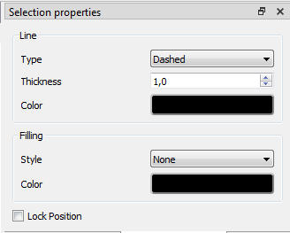

.. _en/schema/basics/rectangle

===========================
Working with rectangles
===========================

Create rectangle
###################

.. note::

    To draw more easily, the folio grid can be displayed from **Display > Display the grid** or from the tool bar icon |icon_grid|. 

The rectangle can only be added to the workspace by the tool bar.

    1. Select the icon |icon_rectangle| from the toolbar to add a rectangle.
    2. Click on the initial vertix from the rectangle at the workspace.
    3. Click on the end vertex from the rectangle at the workspace.

.. |icon_grid| image:: graphics/qet_grid_icon.png
.. |icon_rectangle| image:: graphics/qet_rectangle_icon.png

.. note::

   If the toolbar is not displayed, it can be displayed from **Settings > Display > Add**.

Rectangle properties
#######################

The edges and the internal area from the triangle can be costumized at QElectroTech.   

With reference to edges from the rectangle, for QElectroTech the edges are lines. Please refers to the 
:ref:`Line properties` section for more information.

With reference to the internal area from the rectangle, QElectroTech allows defining the color and 
how to fill the area (None, Solid or many different types of grid).

Regarding to the color from the rectangle area, QElectroTech allows choosing the color inside the RGB scale range 
The color can be choosed by the RGB code or by the HTML color code.

.. figure:: graphics/qet_color_window.png
   :align: center

   Figure: QElectroTech Color selection PopUP window

.. note::

    The position from the rectangle can be locked to prevent involuntary movement. Go to rectangle 
    properties and check the **Lock position** button.

The rectangle properties can be displayed from the Menu bar, by right click on one rectangle edge, 
from selection properties panel and using keyboard shortcut.

Rectangle properties from Menu bar
~~~~~~~~~~~~~~~~~~~~~~~~~~~~~~~~~~

    1. Select one of the edges from the rectangle which should be edited.
    2. Select **Edit > Edit the selected object** menu item to display the rectangle properties PopUP window.

.. figure:: graphics/qet_menu_edit.png
   :align: center

   Figure: QElectroTech Edit menu

Rectangle properties by right click
~~~~~~~~~~~~~~~~~~~~~~~~~~~~~~

    1. Right click on one of the edges from the rectangle which should be edited.
    2. Select the option **Edit the selected object** to display the rectangle properties PopUP window.

.. figure:: graphics/qet_line_right_click.png
   :align: center

   Figure: QElectroTech rectangle selection PopUP window

Rectangle properties from selection properties panel
~~~~~~~~~~~~~~~~~~~~~~~~~~~~~~~~~~~~~~~~~~~~~~~

    1. Select one of the edges from the rectangle which should be edited and the properties from the rectangle will appear at the selection properties panel.

   Figure: QElectroTech Rectangle properties panel

.. note::

   If the properties panel is not displayed, it can be displayed from **Settings > Display > Selection properties**

Rectangle properties using keyboard shortcut
~~~~~~~~~~~~~~~~~~~~~~~~~~~~~~~~~~~~~~~

As many other tools, QElectroTech is an applications which allows using keyboard shortcut.

    1. Select one of the edges from the rectangle which should be edited.
    2. Press ``Ctrl + e`` to display the rectangle properties PopUP window.

For more information about keyboard shortcut, please refers to **keyboard shortcut** section.