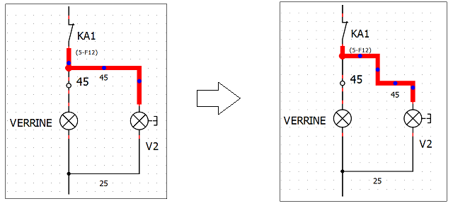

.. _users/schema/conductor/conductormodify

================
Modify conductor
================

By defaul QElectrotech draws a conector minimizing the horizontal and vertical lines. Some times is necessary 
changing the route of the conductor for a clear understanding of the schema. QElectroTech allows modifying 
the route.

   Figure: QElectroTech modify conductor

To modify the route of the conductor:

    1. Select the conductor which route should be modified.
    2. Press on of the control point, blue points, from the conductor displayed.
    3. Without releasing the control point, displace the control point horizontally or vertically until desired position.