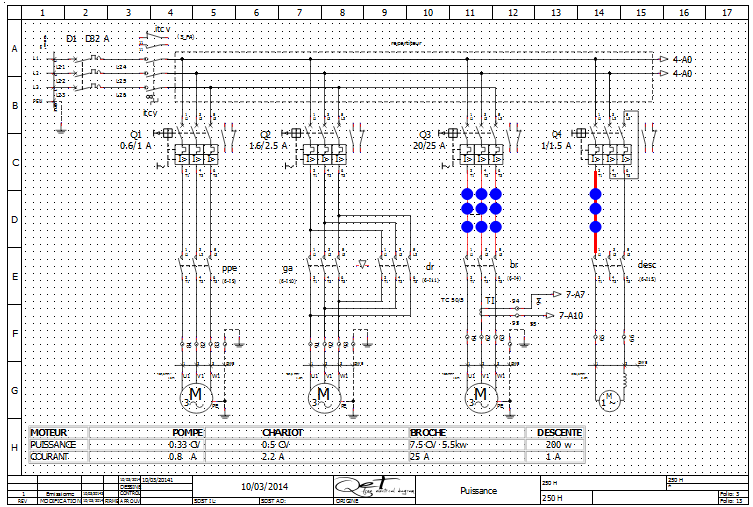

.. _en/schema/select/selectmultipleobjects

=======================
Select multiple objects
=======================

As many other CAD tools, many objects (element, conductor, text field, picture or basic object) from 
QElectroTech workspace can be selected at the same time. 

Select multiple objects using keyboard and mouse
~~~~~~~~~~~~~~~~~~~~~~~~~~~~~~~~~~~~~~~~~~~~~~~~

QElectroTech allows selecting multiple object from the workspace, drawing area, combining the use of 
the keyboard and mouse.

    1. Select the fist object.
    2. Press ``Ctrl``.
    3. Select the rest of objects without releasing ``Ctrl``.

    Figure: QElectroTech schema

Select multiple objects by selecting area
~~~~~~~~~~~~~~~~~~~~~~~~~~~~~~~~~~~~~~~~~

QElectroTech allows selecting all objects from an area using the mouse to select the desired area.

    1. Left click on the initial point from the rectangular area to be selected and displace the mouse without releasing the mouse.

.. figure:: graphics/qet_workspace_select_objects.png
   :align: center

   Figure: QElectroTech selecting on workspace